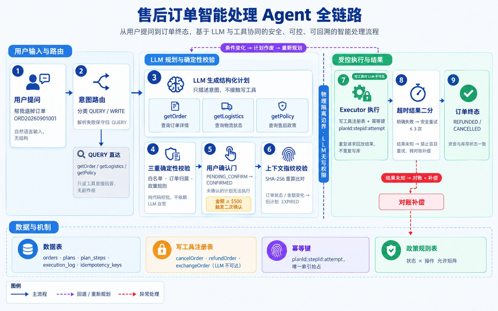
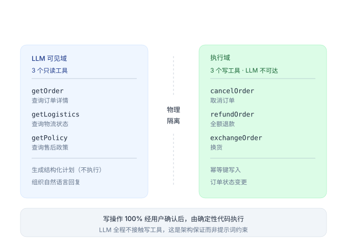

<div align="center">

# AfterSale Agent

**让 LLM 安全地执行高风险写操作 —— 一个 Plan-and-Execute 售后订单智能体**

写工具对 LLM 物理不可见 · 写操作必经用户确认 · 上下文指纹防 TOCTOU · 超时结果二分 · 幂等执行

[](https://openjdk.org/projects/jdk/17/)
[](https://spring.io/projects/spring-boot)
[](https://spring.io/projects/spring-ai)
[](https://www.mysql.com/)
[](#-测试)
[](#-评测)
[](LICENSE)



</div>

---

## 📕 目录

- [项目简介](#-项目简介)
- [核心特性](#-核心特性)
- [安全模型](#-安全模型)
- [系统架构](#-系统架构)
- [快速开始](#-快速开始)
- [API 参考](#-api-参考)
- [评测](#-评测)
- [崩溃恢复实验](#-崩溃恢复实验)
- [不支持范围与已知局限](#️-不支持范围与已知局限)
- [配置项](#️-配置项)
- [项目结构](#-项目结构)
- [Roadmap](#️-roadmap)
- [测试](#-测试)
- [License](#-license)
---

## ✨ 项目简介

电商售后是 LLM Agent 的**高风险落地场景**：用户一句"帮我退掉"，背后可能是资金回流、库存变更、客诉记录。让 LLM 直接调用写工具，等于把资金操作交给一个会幻觉的模型——一旦误执行，代价不可逆。

**AfterSale Agent** 提供一套可参考的工程方案，把"LLM 执行写操作"从**提示词约束**升级为**架构约束**：

> LLM 在高风险写操作上**够不着工具**，也**说了不算**——它只能提出计划，执行权始终握在确定性代码与用户手里。

项目基于 OpenAI 兼容协议接入大模型，可对接任意兼容端点（Qwen / GLM / MiniMax / OpenAI 等），业务侧零改造。配套 36 例消融评测与 [τ-bench](https://github.com/sierra-research/tau-bench) 外部基准验证。

---

## 🌟 核心特性

### 🧭 意图路由与查询问答

- LLM 将用户输入分类为 `QUERY` / `WRITE`，解析失败**保守归 QUERY**（无副作用一侧）
- 查询走只读 ReAct：订单详情、物流状态、售后政策即问即答
- **支持不带订单号的指代式提问**："我最近买的那个咖啡机的物流"、"我上次买的蓝牙耳机"——先由
  `listMyOrders` 按商品名关键词（或最近订单）定位，再查详情；模型不知道订单号时**不会反问用户要单号，
  更不会编造**。关键词没命中时如实说明未找到，并列出最近订单供用户确认

### 📋 Plan-and-Execute 执行范式

- 写操作先由 LLM 生成**结构化计划**，经**白名单 / 归属 / 政策**三重确定性校验后落库
- 校验逻辑是纯代码，不依赖 LLM 自觉——工具名合法的同时，订单必须属于该用户、当前状态必须允许该操作
- 计划经用户确认后才进入执行器，未确认的计划无法执行

### 🔒 构造性安全（核心设计）

| 机制 | 说明 |
|---|---|
| **写工具物理隔离** | LLM 的工具集**永远只有只读工具**；写工具注册在执行器侧，LLM 任何路径都拿不到 |
| **用户确认门** | `PENDING_CONFIRM` →（≥$500）`AWAITING_SECOND_CONFIRM` → `CONFIRMED`，状态机驱动 |
| **上下文指纹失效** | 计划生成时记录订单状态+金额+步骤的 SHA-256 指纹，确认时重算；任何条件变化 → 旧计划强制 `EXPIRED`（防 TOCTOU） |
| **越权双层拦截** | 订单归属校验在规划前置 + 执行前置各做一次，LLM 改写订单号也无法绕过 |
| **大额二次确认** | 金额 ≥ $500 必须二次确认，阈值可配置 |

### ⏱️ 故障恢复

| 机制 | 说明 |
|---|---|
| **超时结果二分** | 明确失败（`FAIL_BEFORE_SEND`）→ 安全重试 ≤3 次；**结果未知**（`TIMEOUT_UNKNOWN`）→ 禁止盲目重试，转对账 + 待补偿 |
| **幂等执行** | 幂等键 `planId:stepId:attempt` 唯一索引，原生 `INSERT` 抢占；重复执行回放既有结果而非重复写库 |
| **断点续跑** | 事务边界落在**单次步骤尝试**上：每步的业务写 + 步骤状态 + `execution_log` + 幂等键同事务提交，崩溃后进度不丢；`/api/executor/resume` 从首个非 SUCCESS 步骤继续 |
| **业务拒绝不重试** | 政策拒绝等终态失败（`FAILED_FINAL`）与瞬态失败严格区分 |

> **关于事务边界**：如果整个计划共用一个事务，SIGKILL 会把已成功步骤的进度**和幂等键**一起回滚——
> 幂等键消失意味着重试时没有任何东西能拦住重复执行。在写工具对接真实支付/物流的场景里，
> 外部副作用已经发生、本地回滚不了，这就是实打实的重复退款。
> 因此 `Executor` 刻意不加 `@Transactional`，由 `PlanStateWriter`（计划状态迁移）与
> `StepRunner`（单次尝试）各自独立提交。这条性质有**真实 `kill -9` 实验**背书，见 [崩溃恢复实验](#-崩溃恢复实验)。

### 🧪 可评测性

- 内置故障注入开关，可在执行链路注入明确失败 / 结果未知，验证恢复行为
- 36 例消融评测集 + 官方 τ-bench 接入脚本，评测可复现

---

## 🛡️ 安全模型

传统方案依赖提示词告诉 LLM"写之前要确认"，但提示词可被绕过、可被幻觉违反。本项目的安全是**构造性**的：



**三条硬约束**：

1. LLM 的工具集**不包含**任何写工具 —— 不是"不允许调用"，是"不存在";
2. 未确认的计划**无法**进入执行器 —— 状态机层面禁止;
3. 计划确认后若订单状态/金额变化，**旧计划立即失效** —— 防止用户确认的条件已被篡改。

---

## 🏗️ 系统架构

```
                    ┌──────────────────────────────────────────────┐
                    │                   /api/chat                   │
                    │              AgentOrchestrator               │
                    └───────────────┬──────────────┬───────────────┘
                                    │              │
                      意图路由(LLM)  │              │
                    QUERY ──────────┤              ├──────── WRITE
                                    ▼              ▼
                    ┌──────────────────┐   ┌─────────────────────┐
                    │   QueryAgent     │   │     PlanService      │
                    │  (只读 ReAct)    │   │  LLM → 结构化 Plan    │
                    │  listMyOrders    │   │  白名单/归属/政策校验  │
                    │  getOrder        │   │  → 落库 PENDING       │
                    │  getLogistics    │   └──────────┬──────────┘
                    │  getPolicy       │              │ 用户确认
                    └──────────────────┘              ▼
                                            ┌─────────────────────┐
                                            │     PlanManager      │
                                            │  状态机 + 指纹失效    │
                                            │  ≥$500 二次确认门     │
                                            └──────────┬──────────┘
                                                       │ CONFIRMED
                                                       ▼
                                            ┌─────────────────────┐
                                            │       Executor       │
                                            │  幂等键 / 超时二分    │
                                            │  execution_log 续跑  │
                                            │  写工具注册表（隔离）  │
                                            └─────────────────────┘
```

**数据模型**：`orders` · `conversations` · `conversation_messages` · `plans` · `plan_steps` · `execution_log` · `idempotency_keys` · `policy_rules`

**技术栈**

| 层级 | 选型 |
|---|---|
| 语言 / 运行时 | Java 17 |
| 应用框架 | Spring Boot 3.5 |
| LLM 接入 | Spring AI 1.1（OpenAI 兼容协议） |
| 数据库 | MySQL 8 |
| 前端 | 单页 `index.html`（原生 JS，零构建） |

---

## 🎮 快速开始

### 1. 启动 MySQL

```bash
docker run -d --name aftersale-mysql -p 3306:3306 \
  -e MYSQL_ROOT_PASSWORD=root123 -e MYSQL_DATABASE=aftersale \
  -v $(pwd)/src/main/resources/schema.sql:/docker-entrypoint-initdb.d/schema.sql:ro \
  -v $(pwd)/src/main/resources/data.sql:/docker-entrypoint-initdb.d/data.sql:ro \
  mysql:8
```

首次启动会自动执行 `schema.sql`（建表）与 `data.sql`（种子数据）。

### 2. 配置 LLM

```bash
cp .env.example .env
```

编辑 `.env`（任意 OpenAI 兼容端点均可）：

```bash
LLM_API_KEY=your-api-key
LLM_BASE_URL=https://your-endpoint        # 注意：不带 /v1（Spring AI 自动拼接）
LLM_MODEL=your-model
```

### 3. 启动应用

```bash
export $(grep -v '^#' .env | xargs)
mvn spring-boot:run -Dspring-boot.run.arguments=--server.port=8081
```

打开 **http://localhost:8081** 即可使用内置演示页：聊天区 → Plan 卡片 → 确认/拒绝/执行 → 状态刷新。

> 详细操作见 [USE_GUIDE.md](USE_GUIDE.md)。

---

## 🔌 API 参考

| 方法 | 路径 | 说明 |
|---|---|---|
| `POST` | `/api/chat` | `{userId, message, conversationId?}` → 回复 + `planCard` |
| `GET` | `/api/plan/{id}?userId=` | 计划详情（含步骤） |
| `POST` | `/api/plan/{id}/confirm?userId=` | 确认计划（≥$500 需调两次） |
| `POST` | `/api/plan/{id}/reject?userId=` | 拒绝计划 |
| `POST` | `/api/plan/{id}/execute?userId=` | 执行已确认计划（幂等） |
| `POST` | `/api/executor/resume` | 断点续跑（重启后恢复中断计划） |
| `GET` | `/api/trace/{traceId}` | 只读路径轨迹回放（逐步模型/工具调用） |
| `GET` | `/api/selftest` | 工具层全路径自测（**有副作用**，事务强制回滚） |
| `POST` | `/api/fault?mode=` | 故障注入（**仅评测**）：`FAIL_BEFORE_SEND` / `TIMEOUT_UNKNOWN` / `HANG`；带 `planId`+`stepSeq` 可定向 |

---

## 📊 评测

### 36 例消融评测

评测集覆盖：查询 8 · 取消 8 · 退换 8 · 异常超时 6 · 越权/大额高风险 6。三组配置**同模型同温度**，唯一变量是编排与确认门：

> **口径说明**：用例集已扩充 4 条「指代式查询」（无订单号、靠商品描述定位，如"我最近买的那个咖啡机的物流"），
> 总数变为 40。下表的 V0/V1/V2 分数是**扩充前 36 例口径下的实测结果**，新增用例尚未并入重跑。

| 配置 | 消融变量 | 完成率 | 高风险拦截 |
|---|---|---|---|
| **V2 完整版** | — | **36/36（100%）** | 6/6 |
| **V1** | 去掉 Plan 级确认门 | 35/36（97.2%） | 5/6 |
| **V0 基线** | ReAct 直连（工具级确认） | 31/35（88.6%） | 5/6 |

**归因链**：

```
V0 (ReAct 直连)      88.6%  ── LLM 全权控制写工具与重试
   │  +Plan-and-Execute（写权限收回，计划经确定性校验）      +8.6pp
V1 (无确认门)         97.2%  ── "LLM 临场失误"被结构性消除
   │  +确认门 + 大额分级 + 指纹失效 + 断点续跑              +2.8pp
V2 (完整版)          100%   ── 36/36
```

**V2 相对基线提升 +11.4pp**，三配置在越权/高风险场景均实现 100% 拦截或正确拒绝，**未发生一次未经确认的高风险写操作**。

逐 case 归因见 [eval/EVAL_REPORT.md](eval/EVAL_REPORT.md)。

### τ-bench 外部基准

以 Sierra 官方 [τ-bench](https://github.com/sierra-research/tau-bench) 零售域作为外部验证：官方环境 + 官方工具 schema + 官方 tool-calling agent，仅替换决策模型，**end-state 匹配**判定。

| 基准 | 任务数 | 结果 | 参考锚点 |
|---|---|---|---|
| τ-bench retail（test 前 10 任务） | 10 | **8/10（80%）** | gpt-4o ≈ 82% |

两个基准互补：消融评测验证**编排框架的安全与可靠性**，τ-bench 验证**模型在规范基准下的工具调用能力**。

### 复现评测

```bash
cd eval
# 36 例消融评测（本地脚本驱动，不需要外部基准）
python3 run_eval.py --config V2 --split all --runs 1

# τ-bench 子集：需要先拿到 sierra 官方源码
git clone https://github.com/sierra-research/tau-bench /path/to/tau-bench
export TAU_BENCH_ROOT=/path/to/tau-bench     # 或用 --tau-bench-root 传入
export OPENAI_API_KEY=... OPENAI_API_BASE=...
python3 tau_run.py --n 10 --start 0
```

---

## 💥 崩溃恢复实验

**为什么要有这个实验**：断点续跑的正确性无法靠单元测试证明。测试跑在测试事务里，
被测代码提交了什么会被一并回滚——用橡皮擦去证明铅笔写过字，结论没有意义。
唯一可信的验证方式是真的把进程杀掉，再看库里剩下什么。

```bash
APP_START_CMD='mvn spring-boot:run -Dspring-boot.run.arguments=--server.port=8082' \
  scripts/crash_recovery_probe.sh
```

脚本做的事：造一个两步计划 → 给第 2 步注入阻塞 → 发起执行 → 在第 1 步已提交、第 2 步阻塞中时
`kill -9` → 重启 → `POST /api/executor/resume` → 逐条断言库内状态。

实测结果（SIGKILL 打断执行中的计划）：

| 观测点 | 崩溃后 | 续跑后 |
|---|---|---|
| `plans.status` | `EXECUTING`（否则 resume 扫不到它） | `COMPLETED` |
| `plan_steps` | `0:SUCCESS`, `1:PENDING` | `0:SUCCESS`, `1:SUCCESS` |
| `execution_log` | 第 1 步 1 条 | 第 1 步仍 **1 条**（未被重复执行） |
| `idempotency_keys` | 第 1 步 1 条 | 第 1 步 1 条 |
| 订单 | 第 1 步的取消**已生效** | 第 2 步的取消已生效 |
| `/api/executor/resume` | — | `{"resumed":1}` |

两条断言是重点：**崩溃不丢进度**（第 1 步的状态/日志/幂等键都是提交过的数据），
**续跑不重跑已完成步骤**（第 1 步的执行日志不会变成 2 条）。

配套脚本：
- `scripts/crash_recovery_probe.sh` —— 上述实验，全部断言通过则退出码 0
- `scripts/reset_demo_data.sh` —— 复位演示数据。种子数据用的是 `INSERT IGNORE`，
  被改过的订单不会自动恢复，反复演示会导致"同一份代码、自测从 12/12 变 9/12"的假回归

---

## ⚠️ 不支持范围与已知局限

本项目是一个**可运行的工程方案**，不是生产系统。以下是有意留下的边界，列出来是为了避免误判：

**能力边界**

| 项 | 现状 |
|---|---|
| 长期记忆 | **没有**。会话历史落在 `conversation_messages`，但没有跨会话的用户偏好/事实记忆层——这是有意不做的，避免为凑清单而虚设一层 |
| 多步计划 | 执行器支持多步（`plan_steps` 唯一索引 `plan_id+seq`），但当前规划提示词在多数场景下产出单步计划 |
| 意图路由 | 只有 `QUERY` / `WRITE` 二分，没有置信度阈值与人工转接 |
| 评测样本 | 36 case 消融是单轮结果；τ-bench 只跑了 test 前 10 个任务 |
| 用户模拟 | τ-bench 官方用 LLM 模拟用户，自评测用脚本驱动，交互深度有限 |

**生产化缺口（MVP 边界内有意为之）**

- 无真实支付/物流系统对接——写工具操作的是本地 `orders` 表。**因此"重复执行"在当前实现里
  只是重复改一行状态，代价可逆**；一旦接上真实外部系统，幂等键与对账就是资金安全问题
- 无多租户隔离、无鉴权（`userId` 从请求参数传入，仅用于归属校验，不是身份认证）
- 无监控告警、无分布式锁；`resumeAll()` 是单实例扫描，多实例并发调用会重复接管同一计划
- `/api/selftest` 是有副作用的 GET（会真的调用写工具，靠强制回滚兜底），生产不应这样暴露
- `/api/fault` 故障注入端点无鉴权，生产必须移除

**已知技术债**

- 重试次数的持久化粒度是"单次尝试"：崩溃发生在一次尝试内部时，该次尝试的 attempt 计数会丢失，
  续跑会从这次尝试重新开始。因为幂等键与业务写同事务提交，这里不会造成重复执行，
  但会造成一次多余的尝试
- 补偿任务（`RECONCILE_FAILED` 的记录）只有落账，没有自动重试的调度器

---

## ⚙️ 配置项

| 配置 | 默认 | 说明 |
|---|---|---|
| `aftersale.confirm-threshold-cents` | `50000` | 二次确认金额阈值（美分），$500 |
| `aftersale.agent.disable-confirm-gate` | `false` | 消融：关闭确认门（V1） |
| `aftersale.agent.disable-idempotency` | `false` | 消融：关闭幂等键 |
| `aftersale.agent.disable-timeout-classify` | `false` | 消融：关闭超时二分 |
| `aftersale.agent.react-baseline-mode` | `false` | 消融：ReAct 基线模式（V0） |
| `LLM_BASE_URL` / `LLM_API_KEY` / `LLM_MODEL` | — | 环境变量注入，`.env` 不入库 |

**只读 ReAct 循环的硬边界**（`aftersale.read.*`）。这些是安全边界而非实验开关，
默认值即生产取值——循环控制权在项目自己的代码里，不依赖框架的迭代上限：

| 配置 | 默认 | 说明 |
|---|---|---|
| `max-steps` | `6` | 单次只读请求最多几步（含模型调用与工具调用） |
| `wall-clock-ms` | `30000` | 整次只读请求的墙钟上限 |
| `token-budget` | `12000` | 单次请求累计 token 上限（prompt + completion） |
| `call-timeout-ms` | `20000` | 单次模型调用的墙钟上限，防单点挂死 |
| `retry-max` / `retry-base-backoff-ms` | `2` / `500` | 仅对限流与瞬态错误重试；退避 = base × 2^(n-1) + 抖动 |
| `tool-output-max-chars` | `4000` | 单个工具返回的最大字符数，超出则包装成带 `truncated` 标记的合法 JSON |
| `max-repeated-actions` | `2` | 同参数重复调用累计多少次后主动终止 |
| `fabrication-guard-enabled` | `true` | 反幻觉闸门：答复中的订单号必须能在本回合事实来源里找到出处 |

---

## 📁 项目结构

```
aftersale-agent/
├── src/main/java/com/aftersale/
│   ├── api/            # REST 控制器（chat / plan / execute / trace / selftest / baseline）
│   ├── agent/          # 编排、意图路由、规划、确认门、只读 ReAct 循环、反幻觉闸门、会话
│   ├── executor/       # 执行器、单步尝试、计划状态落盘、写工具注册表、故障注入
│   ├── tools/          # 7 个工具（4 读 3 写）、政策服务、统一错误码
│   ├── domain/         # JPA 实体
│   ├── enums/          # 订单状态 / 计划状态 / 执行状态 / 风险等级
│   └── repo/           # Spring Data JPA
├── src/main/resources/ # schema.sql / data.sql / application.yml / static/index.html
├── src/test/java/      # 验收测试（54 个，不依赖 LLM）
├── eval/               # 评测 harness（cases.json + run_eval.py + τ-bench 驱动 + 报告）
├── scripts/            # crash_recovery_probe.sh / reset_demo_data.sh
├── docs/               # DESIGN.html（设计说明书）/ 架构图
└── USE_GUIDE.md        # 使用与演示指南
```

**想先理解设计再看代码**：从 [`docs/DESIGN.html`](docs/DESIGN.html) 开始——14 节，
按「为什么这么设计 → 每个模块怎么实现」组织，含分层架构、幂等抢占、事务边界、崩溃恢复等图示。
`TECH_SUMMARY.md` 则是同一套机制的**取舍与失败案例**视角（含被否掉的备选方案）。

**执行器的三个类各管一件事**（事务边界的划分见「故障恢复」）：
`Executor` 只做编排（无事务）、`StepRunner` 承担单次尝试的事务边界、`PlanStateWriter` 负责计划状态的独立提交。

---

## 🗺️ Roadmap

已完成（本轮）：
- [x] 只读路径的控制环自研：步数/超时/token/去重/截断全部可测可控
- [x] 读侧构造性反幻觉闸门（答复中的订单号必须可溯源）
- [x] 事务边界下沉到单次步骤尝试：崩溃不丢进度、续跑不重跑（真实 `kill -9` 验证）

待做：
- [ ] 接入真实支付 / 物流系统的适配层（**接入后幂等键与对账从"状态可逆"升级为资金安全**）
- [ ] 多租户与权限模型（当前 `userId` 只是归属校验，不是身份认证）
- [ ] 计划执行的分布式锁与跨实例幂等（`resumeAll()` 目前是单实例扫描）
- [ ] 补偿任务调度（`RECONCILE_FAILED` 记录已有，缺自动重试的调度器）
- [ ] 指标看板与告警（链路 Trace 已有：`/api/trace/{traceId}`）
- [ ] 长期记忆层（跨会话的用户偏好/事实），以及多步计划的规划能力
- [ ] 更多域的工具集（售后以外的交易场景）

---

## 🧪 测试

```bash
mvn test
```

54 个测试，覆盖 schema / 工具契约（含订单列表与关键词定位）/ 政策矩阵 / 意图路由 / 状态机 / 指纹失效 /
幂等 / 超时二分 / 断点续跑 / 只读循环边界（步数、去重、截断、退避、幻觉工具名、反幻觉闸门）/ **崩溃恢复持久性**，
**不依赖真实 LLM**（通过 `LlmPort` 注入 stub）。

其中 `D5DurabilityTest` **刻意不加 `@Transactional`**：测试事务会把"被测代码提交了什么"
一并回滚，而它要验证的正是提交是否真的发生。因此它自己负责精确回收数据。
进程级崩溃的验证不在单测里，见 [崩溃恢复实验](#-崩溃恢复实验)。

---

## 🤝 Contributing

欢迎 Issue 与 PR。提交前请确保 `mvn test` 全绿；涉及安全机制的改动请在 PR 描述中说明对确认门 / 幂等 / 超时二分的影响。

---

## 📄 License

[MIT](LICENSE)
